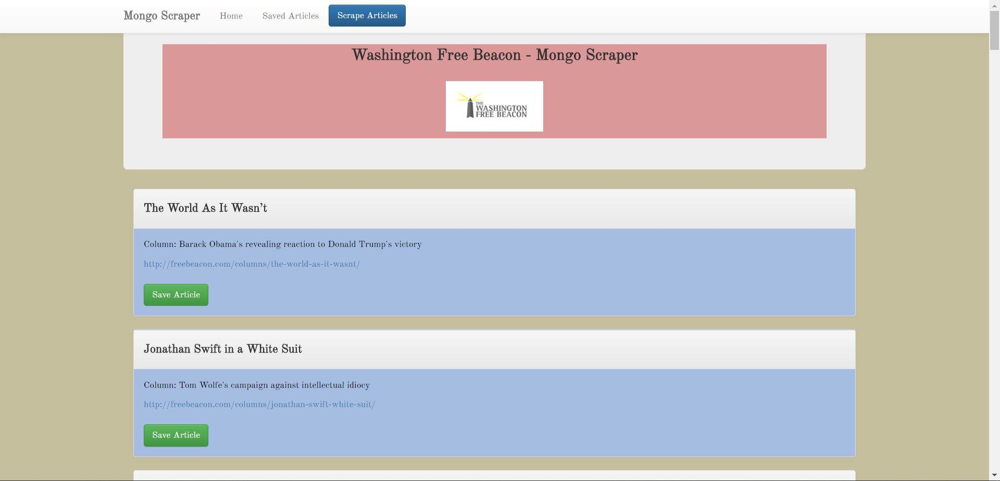

# :newspaper: Mongo-Scraper

### Overview
The Mongo-Scraper application lets users scrape the Washington Free Beacon for the latest columns, save articles, and also leave comments.  Mongo-Scraper saves the scraped data in, you guessed it, MongoDB.  The app uses handlebars.js to render the HTML quickly and cleanly.

### Functionality
  1. <strong>Scrape</strong> Scrape uses Cheerio and Request NPMs to scrape a website.  Request targets HTML elements within the page and Cherrio allows us to grab the HTML elements.
  2. <strong>MongoDB</strong> Mongoose to set up the DB schema in an asynchronous environemnt.  Mongo is the nonrelational DB used for data flexibility.
  3. <strong>Handlebars</strong> Handlebars allows us to cleanly display repeatable html elements using less code.

### Link to App
* <strong>[Mongo-Scraper](https://newbeaconmongoscraper.herokuapp.com/)</strong>

### Technology
* Cherrio for web scraping
* Mongo and Mongoose for DB functions
* Handlebars for rendering HTML

### Screenshot

